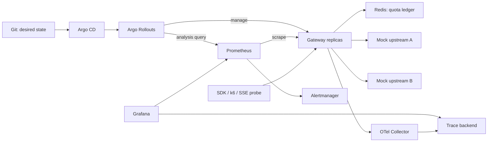

# ai-proxy: SRE ポートフォリオ開発計画

更新日: 2026-09-23 / 状態: 計画段階。M0〜M7 はすべて未着手。

## 目的と完成像

Go 製の小さな Streaming ゲートウェイを運用対象にして、「障害を検知し、影響を抑え、復旧し、再発防止を検証できる」ことを GitHub 上で示す。工数の目安はサービス実装 3、運用と検証 7。

最初の例の機能数には縛られない。中核は次の3つの再現可能なデモと、それを裏付ける計測データ、設計判断、改善履歴とする。

| デモ | 見せる判断 | 保存する証拠 |
| --- | --- | --- |
| 主系 upstream の全断と復旧 | 再試行の制限、切替可能な境界、復旧時の流量制御 | 成功率、追加試行数、ブレーカー遷移、GameDay 記録 |
| 負荷中のローリング更新 | 新規受付の停止と既存 SSE 接続の完了を両立 | 完了率、途中切断数、接続数、Pod 終了時刻 |
| 不良カナリアの自動停止と安定版への復帰 | 観測値に基づく昇格判断、観測不能時の扱い | AnalysisRun、安定版/カナリア別の指標、検知・復帰時間 |

GIF は証拠への入口とし、各デモに再現コマンド、設定、commit SHA、機械可読な結果を添える。実施前に実測値やポストモーテムを作らない。

## スコープ

| 項目 | 方針 |
| --- | --- |
| サービス | Go、HTTP、テキストのみの `/v1/chat/completions`、通常応答と SSE |
| API 互換性 | 対応パラメーターを明示した限定的な互換性。固定した SDK バージョンで契約テスト |
| upstream | 同一プロトコルの mockllm を主系/副系として使用。実 API は1社の最小接続例まで |
| 信頼性 | deadline、キャンセル伝播、同時接続制限、フォールバック、ブレーカー、再試行予算 |
| クォータ | 静的キーごとのトークン予約/精算。Redis + Lua。請求基盤にはしない |
| 観測 | Prometheus、Alertmanager、Grafana、OpenTelemetry Collector とトレース保存先 |
| 検証 | Go のテスト、k6、SSE を逐次検証する Go クライアント、障害注入 |
| 配布・運用 | Compose → kind + Helm → Argo CD + Argo Rollouts |
| 拡張枠 | セマンティックキャッシュ、複数社の API 変換、月次課金予算、管理 UI、クラウド IaC、署名 |

OpenAI の公式資料は新規開発に Responses API を推奨している。本計画では、対象を小さく保ち SDK との接続を検証するため Chat Completions の一部に絞る。Responses、画像、音声、tools の対応は初版に含めない。[OpenAI API reference](https://developers.openai.com/api/reference/resources/chat/subresources/completions/methods/create)

静的キーでも秘密管理は必要。キーは環境変数または Secret から読み、サンプル値以外を Git に置かない。認証情報とプロンプト本文をログ/トレースに残さず、リクエストサイズ、許可モデル、出力上限を制限する。upstream の接続先は設定で固定する。

## 構成



Compose は日常開発、kind はデプロイと障害対応の検証に使用する。Windows では WSL2/Linux コンテナを再現環境の基準とし、M0 で必要なツール、バージョン、CPU/メモリを記録する。バージョンは導入時に互換性を確認して固定する。

## SLI/SLO と測定の約束

利用者が応答を完了できたかを主指標とする。依存先の障害も利用者の失敗に含め、原因の分類は診断用の内訳にする。[Google SRE: Implementing SLOs](https://sre.google/workbook/implementing-slos/)

| 指標 | 定義・初期目標 | 証明の範囲 |
| --- | --- | --- |
| 利用者向け可用性 | 対象要求の正常完了数 / 対象要求数。暫定 SLO 99.9%、移動30日窓 | 短時間の試験は30日実績と区別して表示 |
| 最初の応答までの時間 | クライアント送信から最初の有効な応答イベントまで。失敗/timeout も別件数で併記 | M2 のベースラインから用途別の目標を決める |
| Gateway の処理時間 | upstream 待ちを除くローカル処理区間を計測。p99 < 20ms は初期ベンチマーク目標 | 全体時間から upstream 時間を単純に引いて SLO にしない |
| 主系障害試験 | 副系が正常かつ容量内、送出前の障害で正常完了率 99% 以上を目指す | 障害開始時の要求も含める。送出後の切断試験は別途全件報告 |
| クォータの整合性 | 予約台帳の超過許可、二重返却、テナント間混同が0件 | 実課金トークンの厳密な上限保証とは分ける |
| 更新試験 | 合意した負荷・接続寿命で予期しない失敗/途中切断0件 | 要求数、更新回数、試験時間を併記。無条件のゼロ障害保証にしない |

対象要求は有効な認証と対応スキーマを持ち、契約上のクォータ内にある要求。認証失敗、入力不正、正当なクォータ超過は別の admission 指標に数える。内部過負荷、Redis 障害による拒否、upstream 障害、途中切断は失敗に含める。429 を理由だけで一括除外しない。

SSE は HTTP 200 だけで成功にしない。正常な終端まで到達したかをサーバーと試験クライアントの両方で確認する。クライアント都合のキャンセルは別集計し、遅延や障害に起因する離脱を都合よく除外しない。Pod 強制終了など、サーバーが完了を記録できない障害は外部 probe/負荷クライアントで補足する。

可用性の error budget は対象要求数の 0.1%。枯渇中は通常の機能リリースを止め、復旧・信頼性改善・必要なセキュリティ修正を優先する。予算回復と原因への対策確認を再開条件とする。

バーンレートの初期値は `(1h と 5m の両方で 14.4倍超) OR (6h と 30m の両方で 6倍超)`。低トラフィック、欠損、counter reset のテストを含める。短いデモでは別の短縮設定を明示し、正式な窓は `promtool` の合成時系列で検証する。[Google SRE: Alerting on SLOs](https://sre.google/workbook/alerting-on-slos/)

## 実装前に押さえる設計判断

### Streaming とフォールバック

切替可能な境界は下流へのレスポンスを確定する前とする。最初の有効な upstream イベントを制限付きでバッファし、クライアントにヘッダー/ボディを送出した後は別モデルへ切り替えない。heartbeat や role-only イベントと、最初の内容トークンの時刻は分ける。

途中障害では正常な終端を偽装しない。選定した SDK が検知できるエラー形式と異常終了を契約テストで確認する。TCP 接続、ヘッダー、最初のイベント、イベント間 idle、リクエスト全体に別の期限を設け、slow reader、切断、SIGTERM でも upstream をキャンセルする。

再試行とフォールバックは共通の試行予算と残り deadline を使う。ブレーカーは upstream×model 単位、半開時の試行数を制限する。ネットワークエラー、5xx、429、認証/設定エラーを分類し、429 は Retry-After と過負荷抑制を考慮する。クライアント都合のキャンセルは upstream の失敗率に混ぜない。送出前でも upstream 側で処理済みの場合があるため、再試行を無課金・exactly-once とは扱わない。

### Redis と予約/精算

M1 からプロセス内の同時接続上限を持ち、M4 で共有クォータを追加する。Redis 障害時の初期方針は fail-closed。新規要求は短い期限で 503、クォータ超過は 429 + Retry-After。許可済みの SSE は継続し、精算できない予約は保守的に扱う。

台帳は Redis 時刻を基準とするスライディング窓を第一案とし、request ID、予約時刻、予約額、精算状態を保持する。Lua で予約と一度だけの返却を行い、遅延精算で別の窓にクレジットを付けない。台帳の保持期間とクォータ窓の長さは区別する。各 upstream 試行を予約対象にし、失敗試行のコストも未確定なら保持する。

最終 usage を受け取れない切断では、出力文字列だけから正確な課金量を断定しない。実測値・推定値・不明を分け、usage 不明時は原則返却しない。予約額を実 usage が超えた場合は超過を記録し、その後の許可を抑える。上限保証を主張できるのは既知のコストを使った台帳の競合試験までとする。OpenAI も中断時には最終 usage を受信できない可能性を明記している。[OpenAI API reference](https://developers.openai.com/api/reference/resources/chat/subresources/completions/methods/create)

Redis の再起動とデータ消失も別々に試す。台帳を失った場合に無制限の新規予算を与えないよう、起動世代の検知と最大クォータ窓の待機、または検証済み台帳の復旧を設計する。自動 fail-open への切替は行わない。

### Kubernetes の終了処理

終了開始時に drain 状態へ移り readiness を落とす。経路から外れるまでの伝播を考慮し、SIGTERM 後は新規受付を止め、既存接続を上限時間まで待つ。`preStop` の待ち時間だけで drain を実現したことにしない。猶予時間は `preStop + アプリ終了待ち + 余裕` を収める設定とし、通常の接続寿命と強制終了の条件を明文化する。[Kubernetes: Pod Lifecycle](https://kubernetes.io/docs/concepts/workloads/pods/pod-lifecycle/)

PDB は voluntary eviction のために設定する。ローリング更新の並列停止数は `maxUnavailable` / `maxSurge` と readiness で制御し、両者を別に検証する。HPA には metrics-server、resource requests、上限 replica 数を設定する。CPU と active streams の関係を測り、CPU だけで SSE 容量を説明できない場合はカスタム指標を拡張課題にする。[Kubernetes: Disruptions](https://kubernetes.io/docs/concepts/workloads/pods/disruptions/)

### カナリアの判断と復旧

初版は kind 上の replica 比率による基本カナリアとし、サービスメッシュは導入しない。replica 比率は要求数の厳密な配分ではないため、実際の安定版/カナリアの件数を計測する。正確な重み制御が必要になった段階で traffic routing を追加する。[Argo Rollouts: Canary](https://argoproj.github.io/argo-rollouts/features/canary/)

判定は revision 別の正常完了率、レイテンシ、最低サンプル数を組み合わせる。30日 SLO のアラートを短時間の昇格判定にそのまま使わず、M2 の基準値をもとに短い評価窓と閾値を定める。全体指標も観測し、依存先障害とリリースの回帰を区別する。

データなし、NaN、低トラフィック、Prometheus 到達不能を成功扱いにしない。成功/失敗/不確定/取得エラーを明示し、評価期限まで判定できなければ昇格を止める。アラートと Runbook で継続/中止を判断できるようにする。[Argo Rollouts: Analysis](https://argoproj.github.io/argo-rollouts/features/analysis/)

Argo Rollouts の安定版復帰は Git を書き戻さない。自動復旧のデモはクラスタの状態とトラフィックで判定し、その後の修正版リリースまたは Git revert は別手順として記録する。[Argo Rollouts: FAQ](https://argoproj.github.io/argo-rollouts/FAQ/#does-argo-rollouts-write-back-in-git-when-a-rollback-takes-place)

## マイルストーンと完了条件

| 段階 | 実装・成果物 | 完了条件 |
| --- | --- | --- |
| M0 基盤 | Go module、設定検証、Makefile、Dockerfile、最小 Compose、CI、テンプレート、ADR-0001 | 新規 clone からビルド/テスト/起動が再現でき、CI 結果にリンクできる |
| M1 プロキシと観測 | 最小 mockllm、SSE、静的認証、deadline/cancel、同時接続上限、probes、graceful shutdown、RED、OTel、Grafana | SDK 契約テスト、途中切断と終了処理のテストが通り、要求を trace ID で追える |
| M2 SLO と検証基盤 | SLO 文書、recording/alert rules、Runbook、mock 障害注入、k6 と SSE probe | 正常系の生データ、ルールテスト、障害→アラート→Runbook の記録がある |
| M3 可用性 | フォールバック、ブレーカー、再試行予算、復旧時の流量制限 | 主系全断・復旧・送出後切断の GameDay #1、事後分析と改善後の再試験 |
| M4 クォータ | Redis + Lua、予約/精算、429/503、Remaining ヘッダー、起動時の台帳確認 | 複数 gateway と100並行クライアントで競合試験。Redis 停止/再起動を含む GameDay #2 |
| M5 Kubernetes と配布 | kind、Helm、HPA、PDB、probes/drain、GHCR、SBOM、タグリリース | 負荷中のローリング更新で所定条件内の途中切断0件。強制終了時の限界も記録 |
| M6 GitOps とカナリア | Argo CD、Argo Rollouts、AnalysisTemplate、revision 別計測 | 正常版の昇格、不良版の停止/復帰、観測不能時の昇格停止を再現する GameDay #3 |
| M7 公開用の整理 | 実測値入り README、3本のデモ、容量レポート、ADR/Runbook/事後分析の索引 | 他者が手順だけで再現でき、結果から該当 commit・試験・判断に辿れる |

順序は M0 → M1 → M2 → M3 → M4 → M5 → M6 → M7。M3 終了時点でも「計測→障害→緩和→改善」の一巡を閲覧できる状態にする。M5/M6 を追加しても、先行するデモの再現性を維持する。

各 milestone は複数の小さな Issue/PR に分割する。PR には問題、変更後の挙動、検証、運用への影響を記載する。文書・コード・テストをレビュー可能な単位で組み合わせ、機能全体の巨大 PR を完了条件にしない。

## 最初の Issue 分割案

| ID | Issue の内容 | 受け入れ条件 |
| --- | --- | --- |
| M0-01 | ADR-0001: 目的、対象 API、検証環境、非目標 | 今回のスコープと採用しなかった案の理由を文書化 |
| M0-02 | Go のエントリポイントと設定 | 不正な設定で起動失敗、秘密を出力しない、設定例で起動成功 |
| M0-03 | コンテナとローカル起動 | non-root イメージをビルドし、`make up/down` で起動・終了 |
| M0-04 | CI と依存関係の確認 | format/lint、`go test -race`、build、govulncheck、イメージ scan の結果を確認 |
| M0-05 | GitHub 上の開発運用 | Issue/PR テンプレート、Dependabot、SECURITY、ライセンス方針、Milestones、必須チェックを整備 |
| M1-01 | 正常系 mockllm と API 契約 | 通常応答/複数 SSE イベント/終端を固定 SDK で確認 |
| M1-02 | 認証、制限、キャンセル、終了処理 | slow reader、途中切断、終了中の受付を含むテスト |
| M1-03 | メトリクス、トレース、ダッシュボード | 1要求の完了状態と upstream 試行を照合可能 |

この表はローカルの登録案。GitHub の Issues/Milestones/ブランチ保護は M0 の実装作業で具体化する。必須チェックは実際の job 名に合わせ、一人開発で承認者不在のままマージ不能になる設定を避ける。

CI の action は検証済み commit に固定し、通常 PR は最小権限で実行する。GHCR への書込み権限はリリース job に限定する。イメージは digest とソース commit を対応づける。scan の例外には理由と期限を残し、実行していない coverage/security バッジを掲載しない。

## 検証と運用の成果物

| 分野 | 試験と記録 |
| --- | --- |
| アプリ | SSE の順序・終端・大きなイベント・slow reader・切断伝播・goroutine の残留・race |
| 可用性 | 5xx、429、ヘッダー前/イベント前の遅延、途中切断、全 upstream 障害、復旧直後の負荷 |
| クォータ | 多インスタンス競合、窓境界、重複精算、usage 欠損、process crash、Redis 停止と台帳消失 |
| アラート | 発火/解消、低件数、欠損、counter reset、Runbook リンク |
| リリース | 通常更新、長寿命 SSE、期限超過の強制終了、正常/不良カナリア、観測基盤停止 |
| 容量 | 一定到着率で段階負荷。RPS、同時 SSE 数、CPU、RSS、接続数、TTFT、完了率、負荷生成側の限界 |

k6 は通常の負荷生成とシナリオ制御を担当する。逐次イベント時刻、終端欠損、途中切断は専用 Go probe で確認する。k6 の SSE 拡張を採用する場合は M2 で動作と版を固定し、HTTP の完了時間だけを TTFT として扱わない。

初期の更新試験条件案は、M2 で測った持続可能負荷の50%、最大60秒の SSE、30分間・3回の更新。実行前にマシン条件と母数を固定する。p99 を語れるサンプル数を確保し、結果が不足した場合は測定不足として記録する。

各 GameDay は「仮説、構成、負荷、故障注入、期待挙動、実測、緩和、復旧、改善 Issue、再試験」で記録する。学習環境での演習と明記し、実際の顧客障害や本番実績とは表現しない。

Runbook は症状、影響、確認コマンド、緩和策、復旧確認、判断できない場合の手順を持つ。アラートにはすべて対応する Runbook のリンクを付ける。常時稼働しないローカル環境では、30日 SLO は設計値、デモ中の値は試験実績として表示する。

## ディレクトリ案

以下は必要になる段階で追加する。現時点の実装済みファイル一覧ではない。

```text
cmd/gateway/                  Gateway
cmd/mockllm/                  障害注入付き upstream
cmd/streamprobe/              SSE の逐次検証
internal/config/              設定と検証
internal/server/              API、認証、admission、終了処理
internal/upstream/            upstream 接続と protocol
internal/router/              試行予算とフォールバック
internal/breaker/              ブレーカー
internal/quota/                Redis/Lua と予約台帳
internal/telemetry/            メトリクス、ログ、トレース
deploy/compose/               ローカル開発
deploy/observability/         Prometheus、Alertmanager、Grafana、OTel
deploy/helm/                  Kubernetes の共通 chart
deploy/gitops/                環境ごとの望ましい状態
loadtest/                     負荷と障害シナリオ
docs/adr/                     設計判断
docs/runbooks/                運用手順
docs/gamedays/                 演習手順と記録
docs/postmortems/              事後分析と改善
docs/reports/                  計測条件と結果要約
.github/workflows/            CI とリリース
```

生データや大きな録画は CI artifacts / Release assets に保存し、リポジトリには小さな結果要約と再現情報を置く。保持期限と取得方法も記載する。

## GitHub での見せ方と完成判定

README は一行の目的、実装状況、構成図、再現手順、デモ、目標と実績の比較、運用文書へのリンクの順にする。機能ごとに「実装済み/検証済み/計画」を区別する。

完成時には、依存先障害への対処、予算を伴う SLO、SSE を保った更新、不良リリースの停止という4つの判断を、数値と履歴で説明できる状態を目指す。M0 の最初の作業は ADR と Go/CI の最小基盤とし、その後 M1 の一つの要求を end-to-end で通す。
